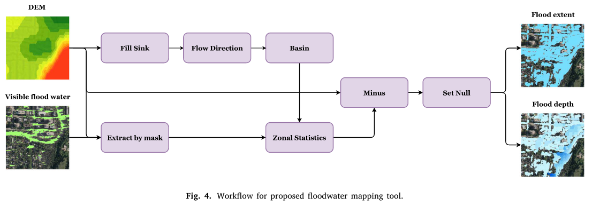

# Flood Mapping Tool From Mask

An ArcGIS Toolbox to estimate flood extent and depth from a visible flood extent and a DEM.



It is difficult to estimate flood extent when shadows or vegetation canopy are present when extracting flood extent from remote sensing imagery. This tool intends to estimate flooded areas outside of the visible floodwater extents. It may not be able to correctly predict the full flood extent without modelling urban stormwater infrastructure, but it could provide a better estimate of the flood extent from the observed standing water from remote sensing imagery.

## Usage

* Inputs
  1. **DEM**
  2. **Visible floodwater polygons**
* Parameters
  1. **Maximum fill depth:** Threshold for not filling shallow sinks.
  2. **Zonal floodwater eleveation percentile:** Threshold for estimating maximum flood elevation within each basin.
* Outputs
  1. **Estimated floodwater extent polygon**
  2. **Estimated floodwater depth raster**

## Citation

If you find this tool helpful, please consider citing [our paper](https://doi.org/10.1016/j.rse.2023.113956):

```
@article{tan2024rapid,
  title={A rapid high-resolution multi-sensory urban flood mapping framework via DEM upscaling},
  author={Tan, Weikai and Qin, Nannan and Zhang, Ying and McGrath, Heather and Fortin, Maxim and Li, Jonathan},
  journal={Remote Sensing of Environment},
  volume={301},
  pages={113956},
  year={2024},
  publisher={Elsevier}
}
```
